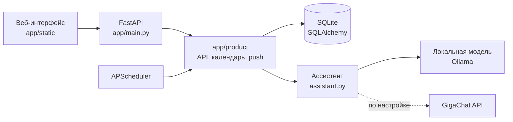

# NeurON

Кабинет пациента с ИИ-помощником и календарём приёма лекарств. Проект выполнен по кейсу
SBERMED AI: сопровождение лечения после назначения врача и запись к специалисту.
Внутреннее имя пакета, переменных окружения (`MEDITRON_*`) и базы — `meditron`.

> **Статус: демонстрационный прототип.** Сервис запускается локально на порту 8000
> (`127.0.0.1:8000`) только для показа. Это не конечная форма поставки: промышленная
> реализация и подготовка к развёртыванию (деплою) запланированы следующими этапами,
> см. [Дорожная карта](#дорожная-карта).

## Возможности

- **«Сегодня»** — приёмы и события текущего дня с быстрыми отметками.
- **ИИ-помощник** — чат, который отвечает по данным пациента (назначения, календарь,
  документы, записи), помогает записаться к врачу и открывает нужный экран.
- **Назначения и план лечения** — препараты, схема приёма, переход в аптеку (ЕАПТЕКА)
  для оформления заказа.
- **Календарь** — недельный вид, курсы из назначений, собственные препараты, витамины,
  питание и любые личные события. Отметки «принял», «пропустил», «отложить»; история
  сохраняется.
- **Прогресс курсов** — выполненные приёмы относительно всех запланированных за курс.
- **Документы** — анализы и справки: поиск, категории, предпросмотр, сроки действия с
  учётом часового пояса пациента.
- **Дневник самочувствия** и история наблюдений.
- **Записи к врачам** — по тестовому расписанию.
- **Напоминания** — фоновая генерация и Web Push (нужен поддерживаемый браузер и
  localhost или HTTPS).

Врач в системе — внешний участник: его кабинета и публикации назначений в сервисе нет.
Демонстрационное назначение создаётся кнопкой «Получить демоназначение».

## Архитектура



Порядок обработки сообщения чата:

1. Точные команды («Открой календарь», «Хочу записаться к врачу») распознаются без модели.
2. Однозначные вопросы о данных («Какие препараты принимать сегодня?») отвечаются
   прямым запросом к базе, в том числе при недоступной модели.
3. Остальное получает языковая модель: сначала планирует, какие данные прочитать, затем
   формулирует ответ. Инструменты только читают данные авторизованного пациента.

Модель не назначает лечение, не меняет дозы и не создаёт записи или покупки сама: любое
действие пациент подтверждает в интерфейсе. Подробности — в [docs/router-nlu.md](docs/router-nlu.md).

## Структура репозитория

```
app/
  main.py        приложение FastAPI, middleware, планировщик, статика
  run.py         локальный запуск с загрузкой .env
  product/       API пациента, календарь, ассистент, клиент LLM, push
  db/            модели SQLAlchemy, запросы, тестовые данные врачей и слотов
  scheduler/     задача напоминаний прежнего прототипа
  nlu/           классификатор намерений и извлечение сущностей (прежний прототип)
  dialogue/      FSM записи к врачу и приёма лекарств (прежний прототип)
  evals/         наборы проверок для замеров моделей
  static/        интерфейс: HTML, CSS, JavaScript, service worker
  benchmark_llm.py, check_llm.py, cli_client.py   служебные утилиты
deploy/ollama/   Modelfile локальной модели
docs/            документация
tests/           автотесты и «живые» проверки с настоящей моделью
```

Каталоги `app/nlu`, `app/dialogue` и `app/scheduler` — первый прототип (NLU + конечный
автомат), он сохранён вместе с тестами и CLI. Основной сервер его не использует; описание в
[docs/legacy-prototype.md](docs/legacy-prototype.md).

## Локальный запуск (демонстрация)

Требуется Python 3.12.

```bash
python3 -m venv .venv
source .venv/bin/activate
pip install -r requirements.txt
cp .env.example .env
python -m app.run
```

Откройте http://127.0.0.1:8000 и нажмите «Открыть демоверсию». Сервер слушает только
loopback-интерфейс и не предназначен для доступа из сети. После изменения `.env`
перезапустите процесс. Таблицы SQLite создаются автоматически, данные сохраняются между
запусками.

### Языковая модель

Для ответов на свободные вопросы нужна локальная модель через Ollama; без неё работают
точные команды и прямые ответы по данным. Подготовка модели описана в
[docs/local-model.md](docs/local-model.md), проверка подключения:

```bash
python -m app.check_llm
```

Основные настройки в `.env` (полный список и значения по умолчанию — в `.env.example`):

| Переменная | Назначение |
| --- | --- |
| `MEDITRON_DB_URL` | строка подключения к базе (по умолчанию SQLite-файл) |
| `MEDITRON_DEMO` | включает демо-вход и демоназначение |
| `MEDITRON_SCHEDULER` | включает фоновые напоминания |
| `MEDITRON_LLM_URL`, `MEDITRON_LLM_MODEL` | адрес и имя модели |
| `MEDITRON_LLM_PROVIDER` | `local` или `gigachat` (облако, для сравнения) |
| `GIGACHAT_AUTH_KEY` | ключ облачного API; хранится только в `.env` |

## Тесты

```bash
HF_HUB_OFFLINE=1 TRANSFORMERS_OFFLINE=1 pytest tests/ -q
```

Обычный запуск не требует запущенной модели и использует временную базу данных. Отдельно:

- `tests/browser_smoke.py` — сквозная проверка интерфейса в Chromium (Playwright);
- `tests/live_*.py` — проверки на настоящей локальной модели с вымышленными данными.

## Ограничения текущей версии

- Вход демонстрационный и не является системой авторизации для реальных пациентов.
- Все данные синтетические; персональные данные не используются.
- Интеграции с ЕАПТЕКОЙ нет: пациент переходит на сайт аптеки и оформляет заказ там;
  покупка подтверждается пациентом вручную.
- Ассистент — организационный помощник, а не источник медицинских рекомендаций.
  Демонстрационные дозы не являются назначением.
- Скорость ответа модели зависит от оборудования; на CPU первый ответ может занимать
  десятки секунд.

## Дорожная карта

Запуск на `127.0.0.1:8000` — временное решение для демонстрации. Планируется:

- настоящая аутентификация и разграничение доступа к данным пациентов;
- перенос с SQLite на серверную СУБД с миграциями;
- контейнеризация, конфигурация окружений и развёртывание за HTTPS-прокси;
- выделенный сервис инференса модели и мониторинг;
- интеграция с аптечным партнёром и медицинской информационной системой;
- соответствие требованиям к обработке персональных данных (152-ФЗ).

## Документация

- [Запуск локальной модели](docs/local-model.md)
- [Чат: быстрые ответы и данные пациента](docs/router-nlu.md)
- [План развития продукта](docs/product-plan.md)
- [Первый прототип (NLU + FSM)](docs/legacy-prototype.md)
