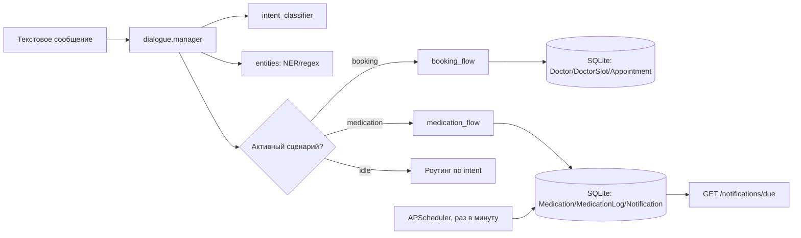

# Архив: исходный прототип NLU + FSM

Историческое описание до перехода на кабинеты и календарь. Указанные ниже HTTP-маршруты больше не обслуживаются основным приложением. CLI и старые тесты сохранены для сравнения.

Прототип для кейса **SBERMED AI**: текстовый диалоговый сервис, который закрывает
два ключевых сценария пациента — **запись к врачу** и **управление приёмом лекарств**
(плюс заглушка «получение справок»). Вход — текстовые сообщения (как если бы их уже
прислал Telegram-бот); REST `/chat` можно подключить к любому каналу позже.

## Почему не ChatGPT/другой платный LLM-API

Вместо вызова стороннего облачного LLM используется лёгкий открытый стек:

- **NLU (распознавание намерения)** — предобученные русскоязычные эмбеддинги
  [`cointegrated/rubert-tiny2`](https://huggingface.co/cointegrated/rubert-tiny2)
  (открытая модель, дистилляция rubert) + небольшая обученная голова
  (`LogisticRegression`) поверх них. Дообучение на своём датасете интентов, а не
  вызов внешнего API — модель работает локально и бесплатно.
- **Извлечение сущностей (даты, время, специальность врача, препарат, дозировка)** —
  детерминированные regex/словарные правила (`app/nlu/entities.py`). Это осознанный
  выбор: в медицинском контексте галлюцинации недопустимы, а размеченного русского
  NER-датасета под эту предметную область нет в открытом доступе.
- **Диалог** — детерминированный конечный автомат (FSM) на Python, а не свободная
  генерация текста: шаг диалога предсказуем и проверяем.

Такой гибрид (классификатор интентов + NER + FSM) даёт контролируемость и
воспроизводимость ответов, что важнее «живости» диалога для сценариев с
медицинскими последствиями (запись к врачу, приём лекарств).

## Архитектура



Эндпоинты (`app/main.py`):
- `POST /chat {user_id, message} -> {reply}` — основной диалог.
- `GET /notifications/due?user_id=...` — очередь напоминаний о лекарствах
  (их потом будет вычитывать Telegram-бот и пушить пользователю).

## Структура проекта

```
app/
  db/            # SQLAlchemy-модели, сид синтетических врачей/расписания, запросы
  nlu/            # intent classifier (rubert-tiny2 + LogisticRegression), NER-правила,
                   # генератор синтетического датасета интентов
  dialogue/       # FSM: booking_flow (запись к врачу), medication_flow (лекарства),
                   # manager (маршрутизация + персистентность состояния)
  scheduler/      # APScheduler job, генерирующий напоминания о приёме лекарств
  main.py         # FastAPI приложение
  cli_client.py   # REPL для ручного тестирования диалога без HTTP
tests/            # pytest: e2e-сценарии FSM + точность NLU
```

## Запуск

```bash
python3 -m venv .venv && source .venv/bin/activate
pip install -r requirements.txt

# (пере)обучить классификатор интентов на синтетическом датасете
python -m app.nlu.generate_dataset
python -m app.nlu.train_intent_model

# ручной диалог в консоли
python -m app.cli_client

# REST API
uvicorn app.main:app --reload
```

Пример запроса:
```bash
curl -X POST http://127.0.0.1:8000/chat \
  -H "Content-Type: application/json" \
  -d '{"user_id": "demo", "message": "хочу записаться к терапевту"}'
```

## Тесты

```bash
pytest tests/ -v
```

Покрытие: полный сценарий записи к врачу (включая определение специальности по
жалобе), полный сценарий добавления лекарства и отметки приёма, отмена диалога на
середине, и точность intent-классификатора на held-out выборке.

## Данные

Всё содержимое БД — **синтетические демо-данные** (вымышленные врачи, слоты,
назначения). Реальные персональные данные пациентов в прототипе не используются и
не хранятся — для продакшн-версии потребуется отдельная проработка 152-ФЗ
(согласие на обработку ПДн, шифрование, разграничение доступа), что заявлено как
зона роста, а не реализовано в рамках прототипа.

## Ограничения и что дальше

- Классификатор интентов обучен на небольшом синтетическом датасете
  (`app/nlu/generate_dataset.py`) — ~0.87 accuracy на held-out выборке. Для продакшна
  нужны реальные диалоги пользователей для дообучения.
- Сопоставление «жалоба → специалист» сейчас реализовано словарём ключевых слов
  (`SYMPTOM_TO_SPECIALTY` в `app/nlu/entities.py`). Явная точка расширения — заменить
  на модель, дообученную на RuMedSymptomRec/RuMedBench (датасеты Sber AI по
  медицинскому NLU), что повысит точность триажа и клинико-экономический эффект.
- «Получение справок» реализовано как заглушка (фиксированный ответ) — сценарий
  вне MVP по итогам кейса.
- Напоминания о лекарствах сейчас отдаются через `GET /notifications/due` (pull);
  при подключении Telegram-бота это легко становится push-уведомлением.

## Клиентский путь (пример)

1. Пациент пишет «у меня болит горло третий день».
2. Бот определяет специальность (терапевт) по жалобе и предлагает ближайшие даты/время.
3. Пациент подтверждает — запись создаётся, слот бронируется.
4. Отдельно пациент добавляет лекарство («добавь лекарство парацетамол 500 мг в 9 и 21»).
5. Сервис ежедневно генерирует напоминания о приёме; пациент подтверждает приём
   сообщением «принял лекарство».

Это снимает рутину с регистратуры/колл-центра (меньше звонков на запись) и снижает
риск пропуска приёма лекарств — что отвечает заявленным в кейсе эффектам:
снижение операционных издержек и удовлетворённость пациентов.
